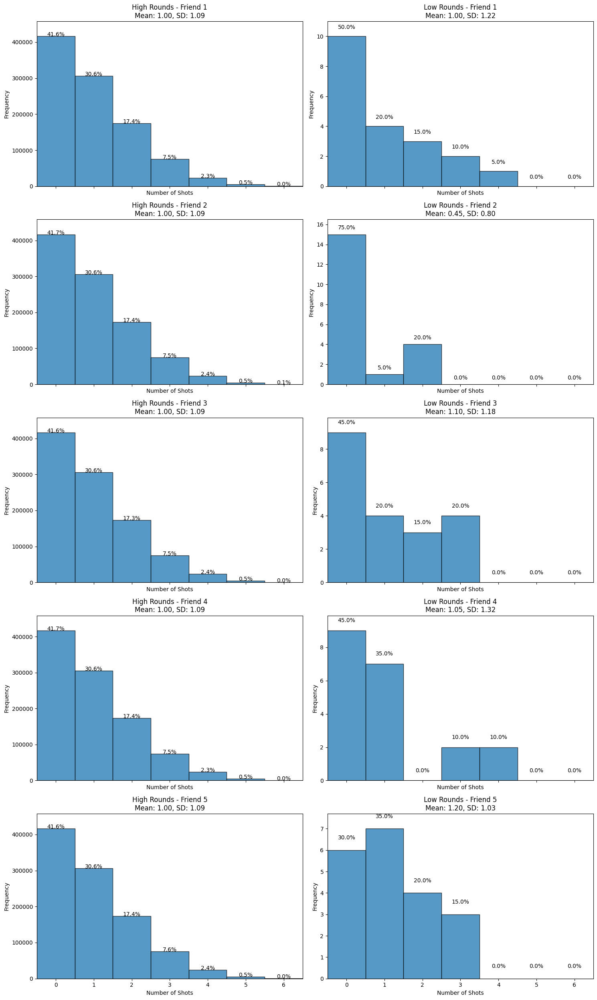
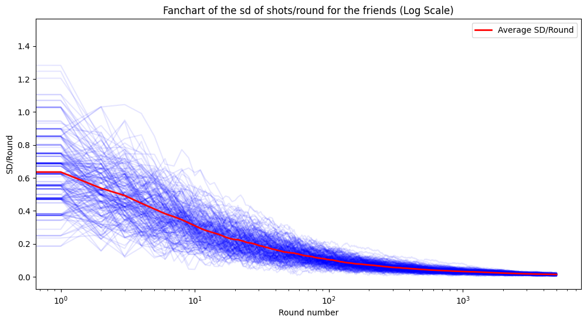
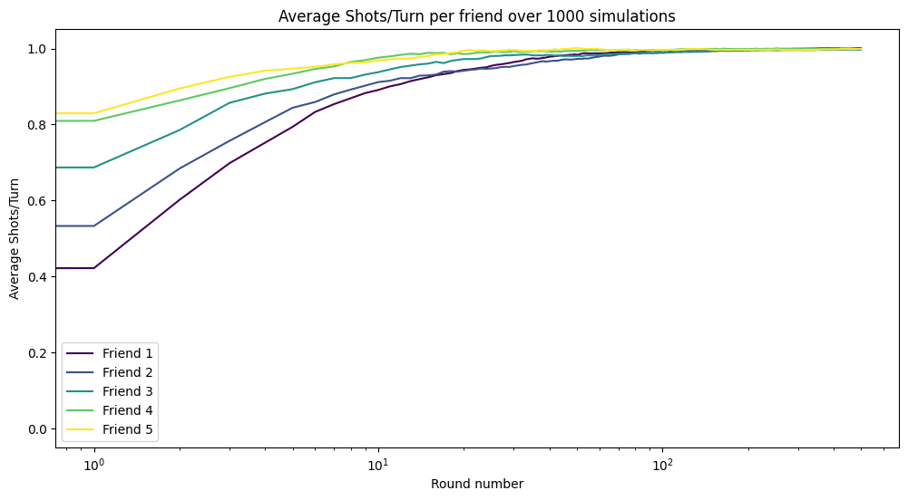

# Party Game Simulations

## Introduction

Drinking games have been a part of human social life for centuries. From ancient civilizations to modern times, these games have provided a means for social interaction, celebration, and sometimes competition. In ancient Greece, drinking games like Kottabos were popular during symposia, where participants would throw the dregs of their wine at targets. In China, during the Tang Dynasty, drinking games involved poetry and challenges of wit. Today, drinking games are ubiquitous in social gatherings, often involving cards, dice, or other simple game mechanics to create a fun and engaging atmosphere.

This repository contains a Python simulation of a specific drinking game involving dice and glasses. The game is designed to model the drinking behaviors and turn-taking dynamics among a group of friends over a series of turns. The simulations help to analyze and visualize various statistical properties of the game, such as the average number of shots per turn and the variability in drinking patterns.

## Game Rules

The game is played with a group of friends and involves the following rules:

1. **Setup**:
    - There are six glasses, some of which are empty and some contain alcohol.
    - The game starts with all glasses empty.

2. **Turn Mechanics**:
    - The first friend rolls a fair six-sided die.
    - If the number rolled corresponds to a full glass, the friend drinks it and rolls again until they land on an empty glass.
    - Upon landing on an empty glass, the friend fills it with alcohol and ends their turn.
    - The next friend then takes their turn following the same rules.

3. **Game Progression**:
    - The game continues in this manner, with each friend taking turns rolling the die, drinking from full glasses, and filling empty glasses.
    - The simulation models the game over 1000 turns for a specified number of friends. We use 5 friends as an example, but the results are robust to other numbers of friends.

## Results

### Average Behavior

In a long game, on average, the players drink one shot per round, with a standard deviation of 1.09. If a small number of rounds is played, there are significant differences in the likelihood of getting a specific number of shots (3, for example) between the players.

The small game is simulated with 20 rounds, and the large game is simulated with 1,000,000 rounds.

### Estimation of the Standard Deviation Within the Players' Total Consumption

We simulated 200 paths of 5000 rounds, then calculated the cumulative consumption per round in all the paths. Finally, we calculated the standard deviation in each round. The average standard deviation of the 200 paths is an unbiased estimator of the standard deviation of the random process.

With not too many rounds, the standard deviation between players is around 0.5 shots! A longer game decreases the deviation between players.

### Who Drinks the Most?

Our results show that, in short games, the first players to start drink the least. A longer game tends to equalize the total drinking. 1000 simulations back this result.

## Conclusion

This simulation provides a detailed analysis of the drinking game, offering insights into the average and variability of drinking patterns among friends. By visualizing these patterns, we can better understand the dynamics of the game and the behavior of its participants. Whether for academic interest or simply for fun, this project showcases the intersection of social games and statistical analysis.

## License

This project is licensed under the BSD 2-Clause License - see the [LICENSE](LICENSE) file for details.
